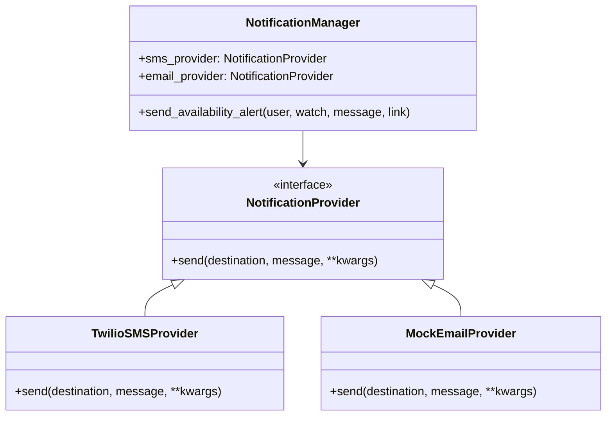

# Notification System Design (Sprint 4)

## 1. Overview
The Notification System is responsible for alerting users when a watched property becomes available. It handles channel selection (SMS/Email), provider integration (Twilio/SendGrid), and logging of all notification attempts.

## 2. Data Models

### 2.1 Notification Model
**File:** `app/models/notification.py`

We need a dedicated model to track every notification attempt for audit and debugging purposes.

```python
from enum import Enum
from datetime import datetime
from typing import Optional
from pydantic import BaseModel, Field
from app.models.pyobjectid import PyObjectId # Assuming a helper for ObjectId handling if exists, else standard str/ObjectId handling

class NotificationType(str, Enum):
    SMS = "sms"
    EMAIL = "email"

class NotificationStatus(str, Enum):
    PENDING = "pending"
    SENT = "sent"
    DELIVERED = "delivered"
    FAILED = "failed"

class NotificationCreate(BaseModel):
    """Schema for internal creation of a notification"""
    user_id: str
    watch_id: str
    type: NotificationType
    destination: str  # Phone number or Email
    message: str
    deep_link: Optional[str] = None

class NotificationInDB(BaseModel):
    """Schema for MongoDB storage"""
    id: Optional[str] = Field(None, alias="_id")
    user_id: str
    watch_id: str
    type: NotificationType
    destination: str
    message: str
    deep_link: Optional[str] = None
    status: NotificationStatus = NotificationStatus.PENDING
    provider_id: Optional[str] = None  # e.g., Twilio SID
    error_message: Optional[str] = None
    created_at: datetime = Field(default_factory=datetime.utcnow)
    sent_at: Optional[datetime] = None
    
    class Config:
        populate_by_name = True

class NotificationResponse(BaseModel):
    """Schema for API responses"""
    id: str
    watch_id: str
    type: NotificationType
    status: NotificationStatus
    message: str
    created_at: datetime
```

### 2.2 User Preferences
**File:** `app/models/user.py` (Update)

The `User` model already contains `smsEnabled` and `emailEnabled`. We will define a specific schema for updating these preferences.

```python
class NotificationPreferencesUpdate(BaseModel):
    smsEnabled: Optional[bool] = None
    emailEnabled: Optional[bool] = None
```

## 3. Service Architecture

We will use a **Provider Pattern** to allow easy swapping or addition of notification channels.

### 3.0 Class Diagram


**Directory Structure:**
```
app/services/notification/
├── __init__.py
├── base.py       # Abstract Base Class
├── sms.py        # SMS Implementation (Twilio)
├── email.py      # Email Implementation (Mock/SendGrid)
└── manager.py    # Main Service Facade
```

### 3.1 Abstract Base Class (`base.py`)
```python
from abc import ABC, abstractmethod
from typing import Any, Dict

class NotificationProvider(ABC):
    @abstractmethod
    async def send(self, destination: str, message: str, **kwargs) -> Dict[str, Any]:
        """
        Sends a notification.
        Returns a dictionary containing provider-specific metadata (e.g., message_id, status).
        """
        pass
```

### 3.2 SMS Service (`sms.py`)
Wraps the existing `TwilioClient` (from `app/integrations/twilio_client.py`).

```python
from app.services.notification.base import NotificationProvider
from app.integrations.twilio_client import send_sms

class TwilioSMSProvider(NotificationProvider):
    async def send(self, destination: str, message: str, **kwargs) -> Dict[str, Any]:
        # Logic to call send_sms
        # Return {"provider_id": sid, "status": "sent"}
        pass
```

### 3.3 Email Service (`email.py`)
A mock implementation for MVP.

```python
from app.services.notification.base import NotificationProvider

class MockEmailProvider(NotificationProvider):
    async def send(self, destination: str, message: str, **kwargs) -> Dict[str, Any]:
        # Log the email content
        # Return {"provider_id": "mock-id", "status": "sent"}
        pass
```

### 3.4 Notification Manager (`manager.py`)
This is the main entry point for the application code. It handles:
1.  Checking user preferences (is SMS enabled?).
2.  Persisting the `Notification` record to MongoDB with status `PENDING`.
3.  Selecting the correct provider.
4.  Sending the message.
5.  Updating the `Notification` record with result (success/fail, provider_id).

```python
class NotificationManager:
    def __init__(self):
        self.sms_provider = TwilioSMSProvider()
        self.email_provider = MockEmailProvider()

    async def send_availability_alert(self, user: UserInDB, watch: WatchInDB, message: str, link: str):
        # 1. Check User Preferences
        # 2. If SMS enabled:
        #    - Create NotificationInDB (PENDING)
        #    - self.sms_provider.send(...)
        #    - Update NotificationInDB (SENT/FAILED)
        # 3. If Email enabled:
        #    - (Similar flow)
```

## 4. API Strategy

### 4.1 Update Preferences
**Endpoint:** `PATCH /api/v1/users/preferences`
*   **Request:** `NotificationPreferencesUpdate`
*   **Response:** Updated User profile.
*   **Logic:** Updates `smsEnabled` / `emailEnabled` flags on the user document.

### 4.2 Webhooks (Optional/Future)
**Endpoint:** `POST /api/v1/webhooks/twilio`
*   **Purpose:** Receive delivery status updates from Twilio (sent, delivered, undelivered).
*   **Logic:** Update `NotificationLog` status based on `MessageSid`.

### 4.3 Notification History (Optional for MVP)
**Endpoint:** `GET /api/v1/notifications`
*   **Response:** List of `NotificationResponse`
*   **Query Params:** `limit`, `skip`